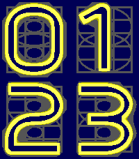

# Neon

A configurable nixie-inspired Pebble watchface by **Comfortably Numb**, written in C with PebbleKit JS and local Clay settings.



The stacked hours and minutes preserve Neon's original tube frames, overlapping rings, and electrode grid. Wider hollow numeral outlines improve readability, and color watches add a neon glow. Artwork is rendered at each screen's native size.

| Platform | Screen | Rendering |
| --- | --- | --- |
| Aplite | 144 × 168 | Black and white |
| Basalt | 144 × 168 | Color with glow |
| Diorite | 144 × 168 | Black and white |
| Flint | 144 × 168 | Black and white |
| Emery | 200 × 228 | Color with glow |

Neon follows the watch's 12/24-hour preference, keeps a leading zero, and updates once per minute. It requires no network, location, or health permissions.

Version: **2.0.0**. Original UUID: `13371337-a9cf-43ed-a84d-76f3dc91f626`.

## Release files

The complete publishing set is in [appstore/](appstore/README.md):

- [Neon.pbw](appstore/Neon.pbw), the live-clock watchface bundle for all five platforms.
- Four screenshots and a slideshow GIF for each color platform; two screenshots and a slideshow GIF for each monochrome platform.
- Yellow-on-blue [80 × 80](appstore/icon_80x80.png) and [144 × 144](appstore/icon_144x144.png) App Store icons.

## Build and install

Requires a Pebble SDK/tool supporting all five targets and Node/npm. Verified with Pebble Tool 5.0.40 and SDK 4.33.1. Clay is locked to `@rebble/clay` 1.1.0.

```sh
npm ci
pebble build
pebble install --emulator emery
```

A fresh build produces `build/Neon.pbw`. For a phone-connected watch, enable its developer connection and use `pebble install --phone PHONE_IP`.

## Configuration

Open Neon's settings in the Pebble/Rebble phone app. Clay generates the settings page locally.

- **Digits:** numeral outline color.
- **Neon glow:** halo and subdued wirework color, available on color watches.
- **Background:** screen and hollow stroke interior color.

Color defaults are `#FFFF55` digits, `#FFFF00` glow, and `#000055` background. Monochrome watches offer only black and white, defaulting to white on black. If both monochrome settings match, Neon chooses contrasting digits automatically. Settings persist across restarts and reinstalls.

## Source and artwork

- [src/c/main.c](src/c/main.c): layout, clock updates, palette coloring, AppMessage handling, and persistent settings.
- [src/pkjs/config.js](src/pkjs/config.js): Clay fields and platform restrictions.
- [src/pkjs/index.js](src/pkjs/index.js): Clay initialization.
- [tools/generate_assets.py](tools/generate_assets.py): editable numeral paths and geometric wirework; requires Python 3 and Pillow.
- [resources/images/](resources/images/): native PNGs and 25 × 25 watch menu icons, included so normal builds do not require Python.

To regenerate artwork, run `npm run assets`, then `pebble build`. The smaller platforms use 67 × 80 digit cells; Emery uses 93 × 108 cells.

Color PNGs use a stable 16-entry coverage palette that is recolored on the watch. Keep them as raw resources so the SDK does not reorder the palette. Monochrome resources require `memoryFormat: "1Bit"` and `storageFormat: "pbi"` for correct inverse compositing. Run `pebble clean` before rebuilding if those format declarations change.

## Verification

After building, run `npm test` to check the bundled Clay configuration's open/save/cancel/restore behavior across all five platforms. The check also writes browser test pages to `/tmp/neon-clay/` for validating color choices and platform filtering.

The release was visually checked on all five emulators, including color changes, monochrome inversion, persistent settings, and live time updates. Verification used emulators, not physical watches.
